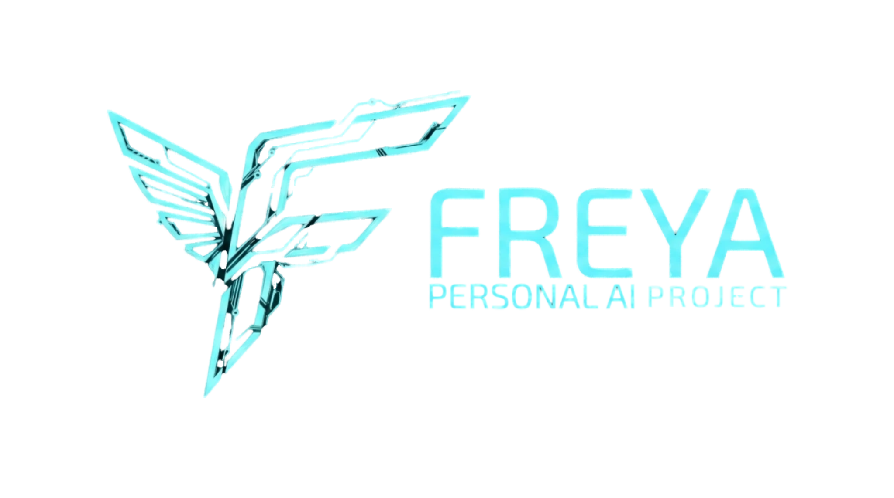

<div align="center">
  

  <p><i>Cloud AI, Simplified.</i></p>
</div>

---

## Credits

Freya is a community fork of **[OpenJarvis](https://github.com/open-jarvis/OpenJarvis)** — a research project from the [Scaling Intelligence Lab](https://scalingintelligence.stanford.edu/) at Stanford SAIL, developed at [Hazy Research](https://hazyresearch.stanford.edu/) as part of the [Intelligence Per Watt](https://www.intelligence-per-watt.ai/) initiative.

**Original authors:** Jon Saad-Falcon, Avanika Narayan, Robby Manihani, Tanvir Bhathal, Herumb Shandilya, Hakki Orhun Akengin, Gabriel Bo, Andrew Park, Matthew Hart, Caia Costello, Chuan Li, Christopher Ré, Azalia Mirhoseini.

**Paper:** [OpenJarvis: Personal AI, On Personal Devices](https://arxiv.org/abs/2605.17172) (arXiv:2605.17172)

Fork maintained by **[Willtanoe](https://github.com/willtanoe)**.

---

## Overview

Freya is a cloud-first AI assistant that connects directly to your favorite model providers — OpenAI, Anthropic, Google Gemini, DeepSeek, Groq, OpenRouter, and more. No local GPU required. Bring your own API keys, and Freya fetches available models dynamically from each provider.

## Quick Start

### Prerequisites
- Python 3.10+
- Node.js 20+
- API key from at least one cloud provider

### Installation

```powershell
# Windows
irm https://willtanoe.github.io/freya/install.ps1 | iex
```

```bash
# macOS / Linux / WSL2
curl -fsSL https://willtanoe.github.io/freya/install.sh | bash
```

### Run

```bash
# Terminal 1 — Backend
freya serve

# Terminal 2 — Frontend
cd frontend && npm install && npm run dev
```

Open `http://localhost:5173` — configure your API keys via the onboarding flow or `⌘K` → Providers.

### Commands

```bash
freya serve                    # start web server (localhost:8000)
freya ask "your question"      # ask a single question
freya doctor                   # check system status
freya init --preset <name>     # switch configuration preset
```

Available presets: `chat-simple`, `code-assistant`, `deep-research`, `morning-digest-mac`, `morning-digest-linux`, `morning-digest-minimal`, `scheduled-monitor`

### Supported Providers

| Provider    | Env Variable         | API Endpoint                           |
|------------|---------------------|----------------------------------------|
| OpenAI     | `OPENAI_API_KEY`     | `https://api.openai.com/v1`            |
| Anthropic  | `ANTHROPIC_API_KEY`  | `https://api.anthropic.com/v1`         |
| Google     | `GEMINI_API_KEY`     | `https://generativelanguage.googleapis.com` |
| DeepSeek   | `DEEPSEEK_API_KEY`   | `https://api.deepseek.com/v1`          |
| Groq       | `GROQ_API_KEY`       | `https://api.groq.com/openai/v1`       |
| OpenRouter | `OPENROUTER_API_KEY` | `https://openrouter.ai/api/v1`         |
| Custom     | `CUSTOM_API_KEY`     | Any OpenAI-compatible endpoint         |

Models are fetched dynamically — no hardcoded lists. Configure a provider and its available models appear instantly.

### Development

```bash
git clone https://github.com/willtanoe/freya.git
cd freya
uv sync --extra dev
uv run pre-commit install
```

## License

[Apache 2.0](LICENSE)
