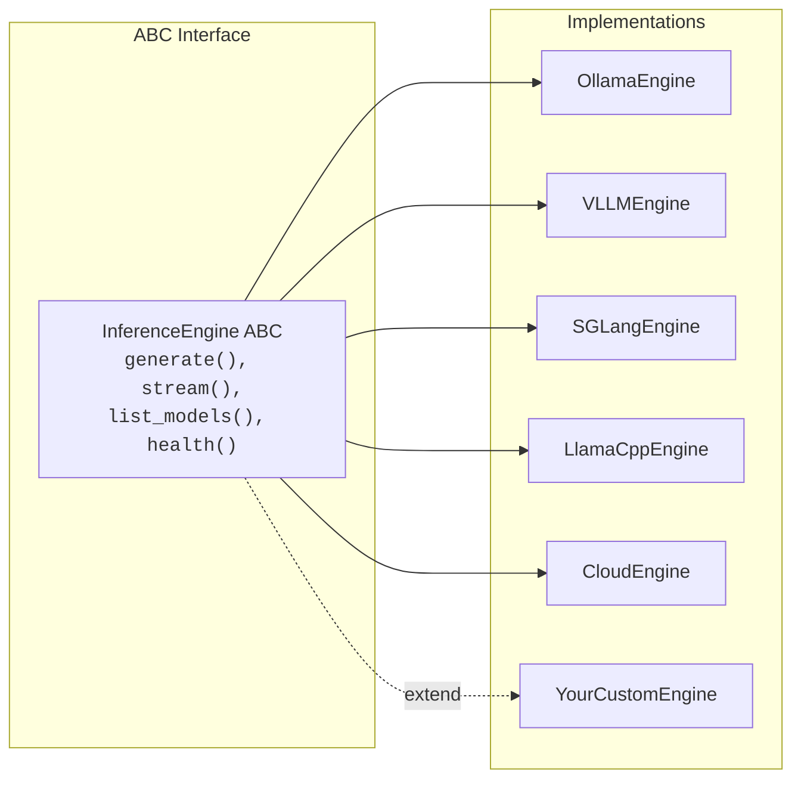

# Design Principles

Freya follows a set of design principles that guide every architectural decision. These principles ensure the framework remains extensible, portable, and easy to work with.

---

## 1. Pluggable Everything

Every major component in Freya is defined as an **abstract base class** (ABC) with concrete implementations registered at runtime. This means you can swap, extend, or replace any part of the system without modifying existing code.



This pattern applies across all five primitives:

| Primitive | ABC | Implementations |
|--------|-----|----------------|
| Engine | `InferenceEngine` | Ollama, vLLM, SGLang, llama.cpp, Cloud |
| Memory | `MemoryBackend` | SQLite, FAISS, ColBERT, BM25, Hybrid |
| Agents | `BaseAgent` | Simple, Orchestrator, NativeReAct, NativeOpenHands, RLM, OpenHands, ClaudeCode, Operative, MonitorOperative |
| Learning | `RouterPolicy` | Heuristic, TraceDriven, GRPO |
| Tools | `BaseTool` | Calculator, Think, Retrieval, LLM, FileRead |

Adding a new implementation requires two things: implement the ABC and register it. The rest of the system discovers and uses it automatically.

---

## 2. Registry-Driven

All extensible components use the **`@XRegistry.register("name")` decorator** pattern. Registration happens at import time, and no factory function or configuration file needs modification.

```python
from freya.core.registry import EngineRegistry
from freya.engine._stubs import InferenceEngine

@EngineRegistry.register("my-engine")
class MyEngine(InferenceEngine):
    engine_id = "my-engine"

    def generate(self, messages, *, model, **kwargs):
        ...
    def stream(self, messages, *, model, **kwargs):
        ...
    def list_models(self):
        ...
    def health(self):
        ...
```

The `RegistryBase[T]` generic base class provides:

- **Class-specific isolation** -- Each typed subclass (`EngineRegistry`, `MemoryRegistry`, etc.) has its own entry storage, so registrations never leak between registries
- **Duplicate detection** -- Registering the same key twice raises `ValueError`
- **Runtime instantiation** -- `Registry.create(key, *args)` looks up and instantiates in one step
- **Introspection** -- `keys()`, `items()`, `contains()` for discovering available components

!!! info "Why decorators instead of configuration files?"
    The decorator pattern means that adding a new component is a single-file change.
    There is no central registry file to edit, no YAML to update, and no factory to modify.
    The component self-registers simply by being imported.

---

## 3. Offline-First

Freya is designed to work **entirely without network access**. All core functionality -- inference, memory, agents, tools, telemetry -- operates locally. Cloud APIs are optional extensions, never requirements.

| Feature | Offline Behavior |
|---------|-----------------|
| Inference | Ollama, vLLM, SGLang, llama.cpp all run via cloud API |
| Memory | SQLite/FTS5 uses built-in Python `sqlite3` module |
| Embeddings | `sentence-transformers` models run via cloud API |
| Telemetry | SQLite-based, fully local |
| Traces | SQLite-based, fully local |
| Tools | Calculator, Think, FileRead all local |
| Configuration | TOML file on disk |

Cloud engines (OpenAI, Anthropic, Google) are available through the optional `cloud` backend, but they are:

- Only registered if the corresponding SDK packages are installed
- Only activated if API keys are set as environment variables
- Never required for any core functionality

```python
# This works without any network connection
from freya import Freya

j = Freya(engine_key="ollama")  # Local freya server
response = j.ask("Hello")
```

---

## 4. Hardware-Aware

Freya **auto-detects system hardware** at startup and recommends the optimal inference engine. The `detect_hardware()` function probes:

| Hardware | Detection Method |
|----------|-----------------|
| NVIDIA GPUs | `nvidia-smi` (name, VRAM, count) |
| AMD GPUs | `rocm-smi` (product name) |
| Apple Silicon | `system_profiler SPDisplaysDataType` |
| CPU | `/proc/cpuinfo` or `sysctl` (brand string) |
| RAM | `/proc/meminfo` or `sysctl hw.memsize` |

The `recommend_engine()` function maps hardware to engines:

| Hardware | Recommended Engine |
|----------|-------------------|
| No GPU | `llamacpp` (CPU-optimized) |
| Apple Silicon | `ollama` (Metal acceleration) |
| NVIDIA datacenter (A100, H100, etc.) | `vllm` (high throughput) |
| NVIDIA consumer | `ollama` (easy setup) |
| AMD GPU | `vllm` (ROCm support) |

This recommendation is written to `config.toml` during `freya init` and used as the default engine:

```bash
freya init --force
# Detects hardware, writes ~/.freya/config.toml with:
# [engine]
# default = "vllm"  # (for A100)
```

---

## 5. Telemetry-Native

Every inference call automatically records timing, token counts, energy usage, and cost to a local SQLite database. Telemetry is a **first-class concern**, not an afterthought.

```python
@dataclass(slots=True)
class TelemetryRecord:
    timestamp: float
    model_id: str
    prompt_tokens: int
    completion_tokens: int
    total_tokens: int
    latency_seconds: float
    ttft: float              # Time to first token
    cost_usd: float
    energy_joules: float
    power_watts: float
    engine: str
    agent: str
```

The `instrumented_generate()` wrapper handles all telemetry transparently:

1. Records start time
2. Calls the engine's `generate()` method
3. Records end time and extracts token counts
4. Publishes a `TELEMETRY_RECORD` event on the EventBus
5. The `TelemetryStore` (subscribed to the bus) persists the record

The `TelemetryAggregator` provides read-only queries over stored records:

```bash
freya telemetry stats          # Aggregated statistics
freya telemetry export --json  # Export all records
```

!!! note "Telemetry is best-effort"
    If telemetry setup fails (e.g., database is locked), the system continues
    without telemetry rather than raising an error. Telemetry never blocks
    the query flow.

---

## 6. Python-First

Freya provides a **clean Python API** through the `Freya` class. There is no framework lock-in -- the SDK is a standard Python package with dataclass-based types and no required web framework.

```python
from freya import Freya

j = Freya()
response = j.ask("Hello")

# Full control
result = j.ask_full(
    "Explain quantum computing",
    model="qwen3:8b",
    agent="orchestrator",
    tools=["think"],
    temperature=0.5,
    max_tokens=2048,
)

# Memory operations
j.memory.index("./docs/")
results = j.memory.search("quantum computing")

# Resource cleanup
j.close()
```

Design choices that support this principle:

- **Dataclasses** for all structured types (`Message`, `ModelSpec`, `Trace`, etc.)
- **Type hints** throughout the codebase
- **No magic** -- explicit initialization, clear method signatures
- **Optional dependencies** via extras (`freya[server]`, `freya[memory-colbert]`, etc.)
- **Standard packaging** with `hatchling` build backend and `uv` package manager

---

## 7. OpenAI-Compatible

The API server (`freya serve`) implements the **OpenAI chat completions API format**, making Freya a drop-in replacement for OpenAI in existing applications.

Supported endpoints:

| Endpoint | Method | Description |
|----------|--------|-------------|
| `/v1/chat/completions` | POST | Chat completions (streaming and non-streaming) |
| `/v1/models` | GET | List available models |
| `/health` | GET | Health check |

Request and response formats match the OpenAI API specification:

```bash
curl http://localhost:8000/v1/chat/completions \
  -H "Content-Type: application/json" \
  -d '{
    "model": "qwen3:8b",
    "messages": [{"role": "user", "content": "Hello"}],
    "temperature": 0.7,
    "max_tokens": 1024,
    "stream": false
  }'
```

Streaming responses use Server-Sent Events (SSE) with `data: [DONE]` termination, matching the OpenAI streaming protocol.

Any OpenAI client library can connect to Freya:

```python
from openai import OpenAI

client = OpenAI(base_url="http://localhost:8000/v1", api_key="not-needed")
response = client.chat.completions.create(
    model="qwen3:8b",
    messages=[{"role": "user", "content": "Hello"}],
)
```

---

## 8. Standalone

Freya requires **no external services** for core functionality. Everything needed to run the system is included or uses standard system libraries.

| Component | Dependency |
|-----------|-----------|
| Configuration | TOML file, built-in `tomllib` (Python 3.11+) or `tomli` |
| Memory (default) | Built-in `sqlite3` module |
| Telemetry | Built-in `sqlite3` module |
| Traces | Built-in `sqlite3` module |
| HTTP client | `httpx` (lightweight, pure Python) |
| CLI | `click` + `rich` |
| Event bus | Built-in `threading` module |

The only external requirement is a running inference engine (Ollama, vLLM, etc.), which is the model server itself -- not a dependency of Freya.

Optional features that require additional packages:

| Feature | Extra | Packages |
|---------|-------|----------|
| FAISS memory | `freya[memory-faiss]` | `faiss-cpu`, `sentence-transformers` |
| ColBERT memory | `freya[memory-colbert]` | `colbert-ai`, `torch` |
| BM25 memory | `freya[memory-bm25]` | `rank-bm25` |
| API server | `freya[server]` | `fastapi`, `uvicorn` |
| Cloud inference | `freya[inference-cloud]` | `openai`, `anthropic`, `google-genai` |
| vLLM engine | `freya[inference-vllm]` | `vllm` |
| PDF ingestion | `freya[memory-pdf]` | `pdfplumber` |
| WhatsApp Baileys | `freya[channel-whatsapp-baileys]` | Node.js 22+ |

This design ensures that a minimal installation (`uv sync`) gives you a fully functional system with SQLite memory, cloud inference, and the complete CLI -- no Docker, no external databases, no cloud accounts required.
